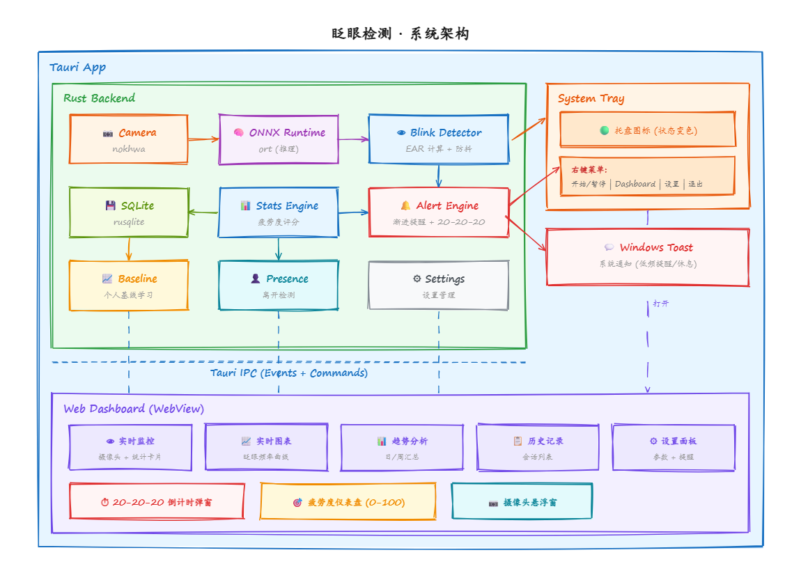

# 眨眼检测器 (ZhaYan)

Windows 系统托盘常驻应用，基于摄像头实时检测眨眼频率，智能提醒用眼疲劳，保护视力健康。

## 系统架构

## 核心功能

- **后台常驻检测** — Rust 原生摄像头采集 + ONNX Runtime 人脸关键点推理 + EAR 眨眼检测
- **系统托盘** — 图标实时反映疲劳状态（绿/黄/橙/红），右键菜单快捷操作
- **智能提醒** — 个人基线学习 + 疲劳度评分 + 渐进式提醒 + 20-20-20 法则
- **离开检测** — 未检测到人脸时自动暂停，数据更准确
- **Dashboard** — 实时监控、图表、趋势分析、历史记录、参数设置

## 技术栈

| 层 | 技术 |
|---|---|
| 桌面框架 | Tauri v2 |
| 后端 | Rust (nokhwa + ort + rusqlite) |
| 前端 | HTML/CSS/JS + Chart.js |
| 数据库 | SQLite |
